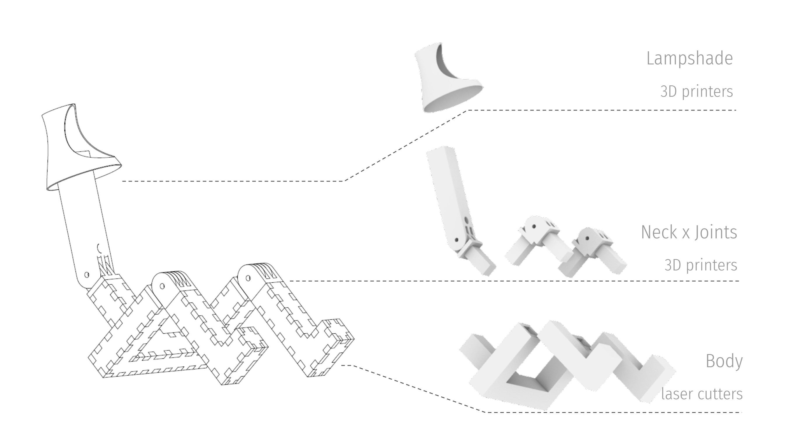
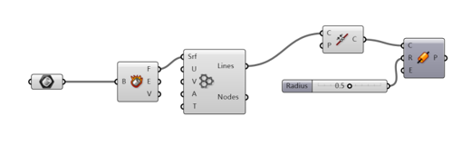
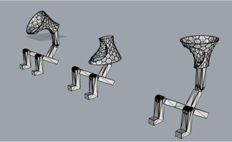
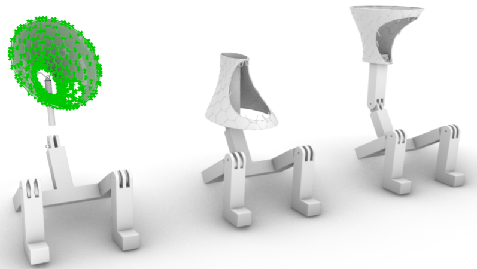
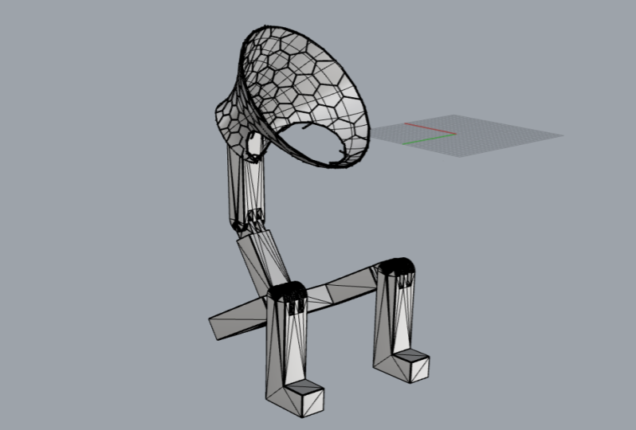
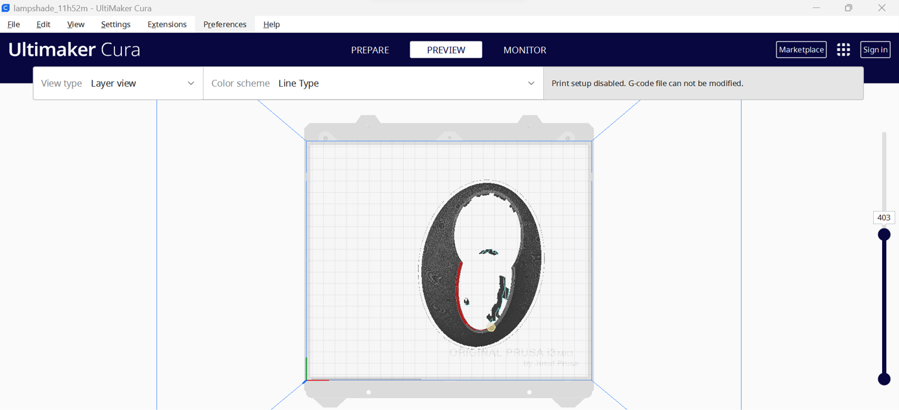
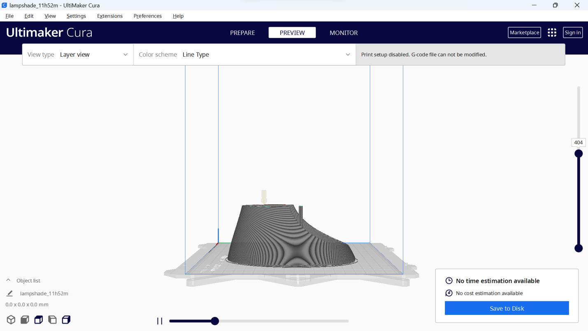
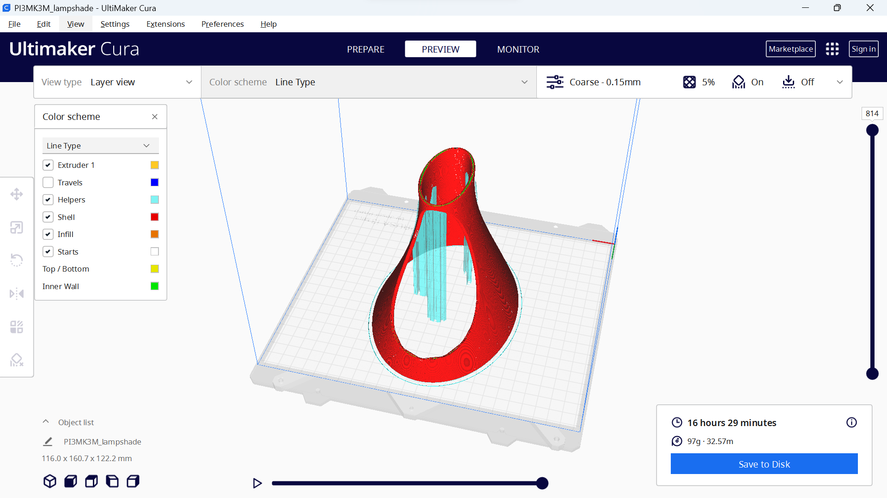
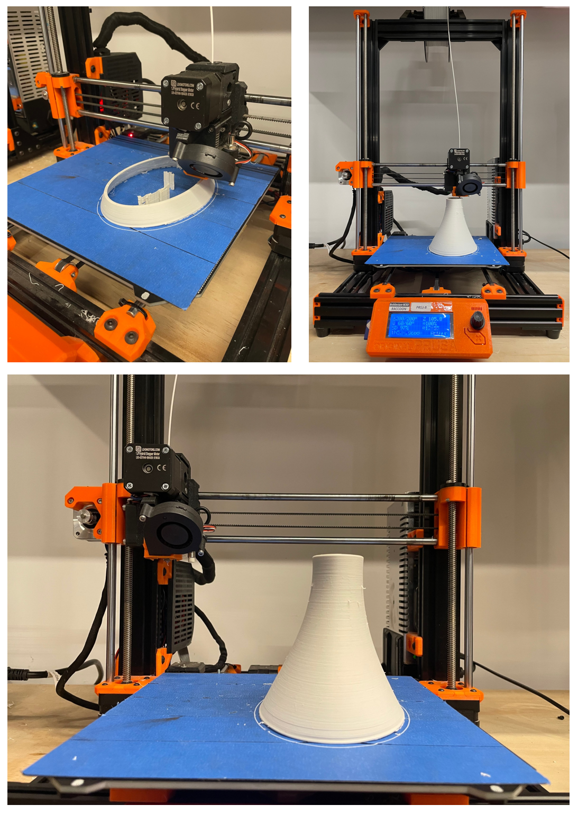

# Puppet-Lamp
Computer Aided Manufacturing Project : utilizing 3D printers and laser cutters.

## Lampshade Modelling

- Hexagonal Structure on the surface.
- Join the curve of Hexagonal Lines.
- Create a pipe surface around a rail curve with 0.5 cm radius.

- Hexagonal Structure to decorate lampshade surface in Grasshopper.

- Concepts & shapes of lamp model.

- Rendered display mode of these lamp model.

- Final program of lamp modeling in Rhino 7.

## Lampshade Printing
###SET-UP

#### Printer: Prusa i3 MK3S
#### Print settings:

- Layer Height: 0.2 mm
- Wall Thickness: 0.8 mm
- Infill Density: 5.0 %
- Infill Pattern: Grid
- Printing Temperature:200.0°C
- Print Speed:60.0 mm/s
- Initial Layer Speed:30.0mm/s
- Build Plate Adhesion Type:Skirt

 

- Top view of lamp shade model for the simulation slicing for 3D printers in Ultimaker Cura.

- Right view of lamp shade model for the simulation slicing for 3D printers in Ultimaker Cura.

- The slicing lamp shade model in line type of color scheme for 3D printers in Ultimaker Cura.

#### Result
- Too thin of a wall is easy to collapse the bottom and support structure.
- The printing path in the Z-axis value is over setting.
- The initial speed is too fast to make sure a completed printing process.

- printing process and result of lamp shade model in PLA.

#### Solution
- Utilize “offsetsrf” command to thicken the surface into 
- Reduce the speed by tuning the 3D printer setting after the 9 times calibration of horizontal foundation.
- The initial speed is too fast to make sure a completed printing process.

## Neck x Joints Modelling

## Neck x Joints Printing
